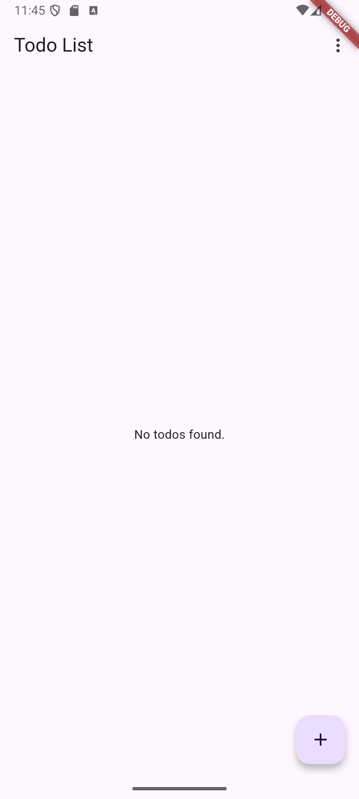
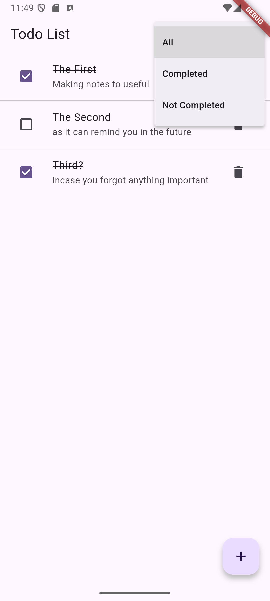
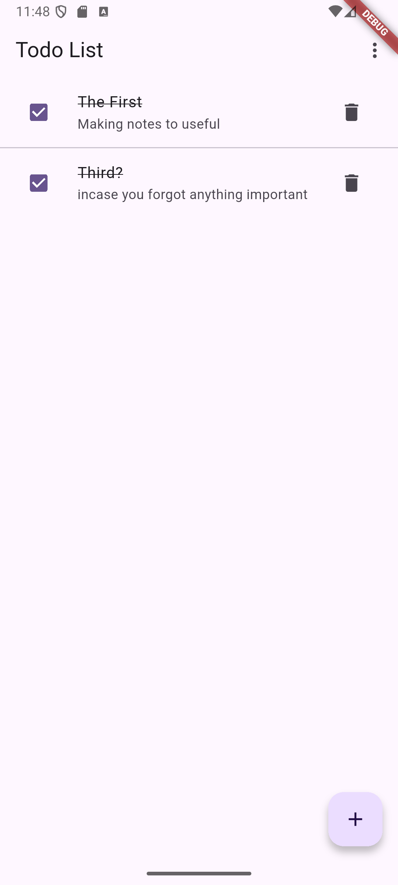
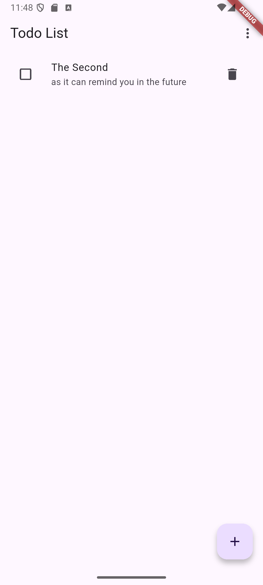
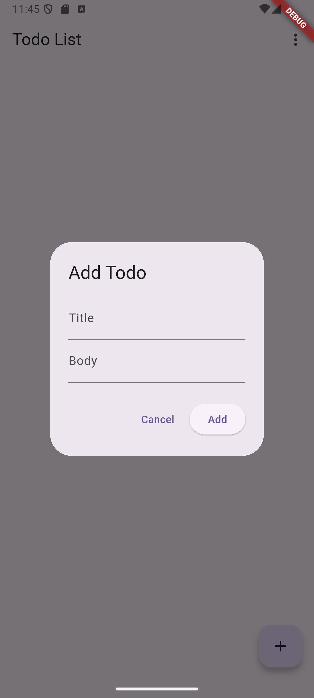
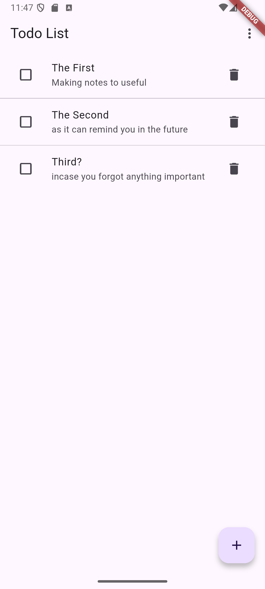

# Todo App with Provider and Floor

This project is a simple and efficient Todo application built with Flutter. It demonstrates modern state management using [Provider](https://pub.dev/packages/provider) and persistent local storage using [Floor](https://pub.dev/packages/floor).

## Features

- **Add, Edit, and Delete Todos**: Easily manage your daily tasks.
- **State Management with Provider**: All UI updates reactively reflect changes in your todo list.
- **Persistent Storage with Floor**: Your todos are stored locally using SQLite, ensuring data is retained even after closing the app.
- **Responsive UI**: A clean and user-friendly interface for a smooth experience.

## Technologies Used

- [Flutter](https://flutter.dev/)
- [Provider](https://pub.dev/packages/provider) for state management
- [Floor](https://pub.dev/packages/floor) for local database storage

## Getting Started

### Prerequisites

- [Flutter SDK](https://flutter.dev/docs/get-started/install)
- An editor like [Android Studio](https://developer.android.com/studio) or [VS Code](https://code.visualstudio.com/)

### Installation

1. **Clone the repository:**
   ```bash
   git clone https://github.com/Mazen-Alnahdi/todo_cca_local_storage.git
   cd todo_cca_local_storage
   ```

2. **Install dependencies:**
   ```bash
   flutter pub get
   ```

3. **Run the app:**
   ```bash
   flutter run
   ```

## Project Structure

- `lib/`
  - `main.dart`: App entry point.
  - `models/`: Todo data models.
  - `providers/`: State management logic using Provider.
  - `database/`: Floor database setup, DAOs, and entities.
  - `screens/`: UI screens for listing, adding, and editing todos.
  - `widgets/`: Reusable UI components.

## Why Provider and Floor?

- **Provider** offers a simple and powerful way to manage app-wide state, making it easy to update the UI in response to data changes.
- **Floor** provides a robust abstraction over SQLite, allowing for type-safe database operations and easy persistence of complex data models.

## Screenshots


<div align="center">
  
  
  
  
  
  
</div>


## Contributing

Contributions are welcome! Please open an issue or submit a pull request for any improvements or bug fixes.

## License

This project is open-source and available under the [MIT License](LICENSE).

---

Built with ❤️ using Flutter, Provider, and Floor.
